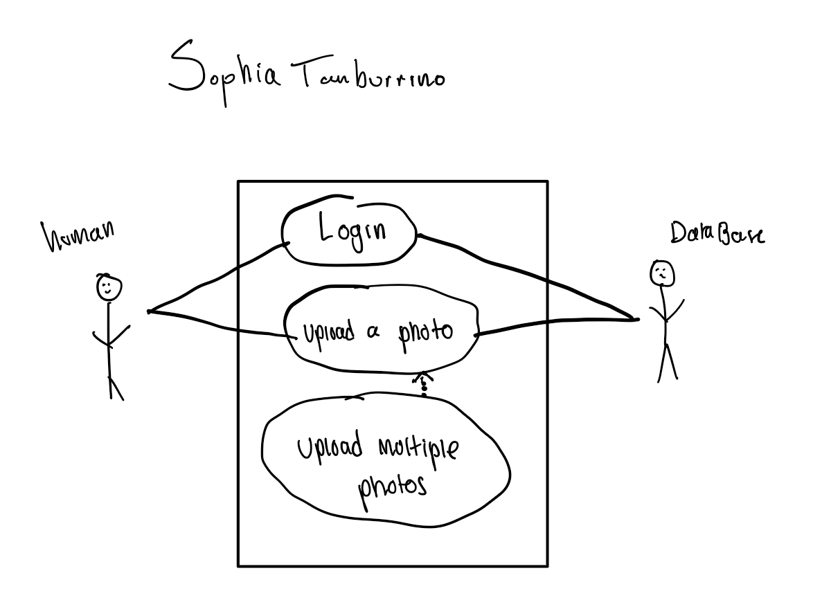
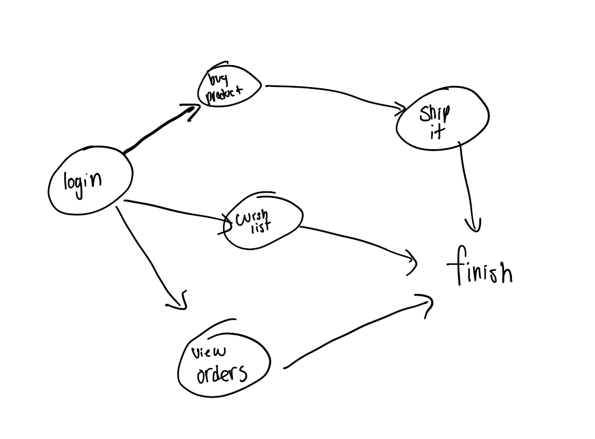

## #1 - What is the difference between a functional and non-functional requirement?
A functional requirement is what the user wants the program to do. A non-functional requirement is what the system is already expected to do. 

## #2 - Give two example functional requirements for Instagram.com
* When you double tap on the screen, the user likes the post.
* When you click a follow button on a profile, the user's follows increase by 1.

## #3 - Give two example non-functional requirements for Instagram.com.
* When you start writing a comment, the keyboard pops up.
* When you go to the camera button, the phone camera turns on.

## #4 - Draw a use case diagram for Instagram.com with at least three uses cases shown, where at least one use case extends another, and there are two actors.

## #5 - Why has software engineering evolved to often embrace agile development models over waterfall ones?
A waterfall method is planning out development for the whole project, while an agile development plans it out piece by piece over time. It is best to embrace agile development as we won't always know the needs of the client/user until we hit a certain point in development.

## #6 - Draw a diagram where there are at least two interconnected paths: a critical path, and at least one non-critical path.

